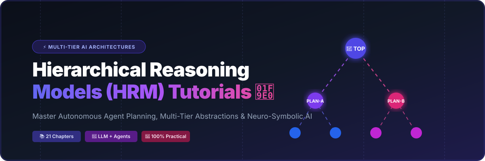

<p align="center">
  
</p>

# 🧠 HRM Tutorials: The Complete Guide to Hierarchical Reasoning Models

<a href="https://github.com/ishandutta2007/Awesome-Awesome-Awesome"></a><a href="https://discord.gg/jc4xtF58Ve"></a>
[](./LICENSE)
[](https://github.com/ishandutta2007/HRM-Tutorials)
[](https://github.com/ishandutta2007/HRM-Tutorials)
[](./CONTRIBUTING.md)
[](https://www.python.org/downloads/)
<a href="https://github.com/ishandutta2007"></a>

> **Master Hierarchical Reasoning Models (HRMs)** 🚀: A comprehensive, open-source tutorial repository covering multi-level cognitive architectures 🏗️, neuro-symbolic reasoning 🧩, LLM supervisor-worker hierarchies 👑, and multi-agent AI systems 🤖.

---

## 📖 Overview

**Hierarchical Reasoning Models (HRMs)** represent a major breakthrough in modern Artificial Intelligence 🤖. By decomposing complex, high-dimensional reasoning problems into structured levels of abstraction—from high-level strategic planning down to low-level execution reasoners—HRMs enable scalable, explainable, and robust AI decision-making 💡.

This repository provides an end-to-end, 21-chapter curriculum 📚 for students 🎓, AI researchers 🔬, machine learning engineers 🛠️, and software developers 💻 wanting to design, train, and deploy hierarchical AI architectures.

### 🔍 Key Topics & Keywords
`Hierarchical Reasoning Models` • `Artificial Intelligence (AI)` • `Machine Learning (ML)` • `Large Language Models (LLMs)` • `Neuro-Symbolic AI` • `Multi-Agent Reasoning` • `Autonomous Robotics` • `Natural Language Understanding (NLU)` • `Deep Learning Architecture` • `Hierarchical Planning`

---

## ✨ Key Features

- 🎯 **Full-Spectrum Curriculum**: 21 structured chapters taking you from foundational concepts to enterprise-grade hierarchical architectures 🏛️.
- 💻 **Hands-On Python Implementations**: Clean, runnable, and modular code examples for supervisor agents and low-level task reasoners 🐍.
- 🤝 **LLM & Agent Integration**: Real-world blueprints for combining HRMs with Large Language Models (GPT, Gemini, Claude, LLaMA) 🤖.
- 🔬 **Industry Case Studies**: End-to-end applications across Natural Language Understanding (NLU) 📖 and Autonomous Robotics 🦾.
- ⚡ **Scalability & Fine-Tuning**: Performance evaluation 📊, hierarchical state management 🌊, debugging tools 🐛, and fine-tuning strategies ⚙️.

---

## 📚 Table of Contents

| # | Chapter | Description |
|---|---------|-------------|
| 01 | [🌟 Introduction to Hierarchical Reasoning Models](./01-Introduction-to-Hierarchical-Reasoning-Models/) | Overview, motivation, and historical context of hierarchical reasoning in AI 🌟 |
| 02 | [🧠 Core Concepts of HRM](./02-Core-Concepts-of-HRM/) | Foundations of multi-tier abstraction, reasoners, and goal decomposition 🧠 |
| 03 | [🤔 The Need for Hierarchy in Reasoning](./03-The-Need-for-Hierarchy-in-Reasoning/) | Limitations of flat models and why complex tasks require hierarchical logic 🤔 |
| 04 | [🆚 HRM vs. Traditional Models](./04-HRM-vs-Traditional-Models/) | Comparative analysis: HRM vs. standard deep networks and flat agent architectures 🆚 |
| 05 | [🛠️ Setting Up Your Environment](./05-Setting-Up-Your-Environment/) | Installation, dependencies, and environment configuration for running tutorials 🛠️ |
| 06 | [🧱 The Building Blocks: Low-Level Reasoners](./06-The-Building-Blocks-Low-Level-Reasoners/) | Implementing primitive task reasoners and atomic execution modules 🧱 |
| 07 | [👑 The Supervisor: High-Level Reasoners](./07-The-Supervisor-High-Level-Reasoners/) | Designing supervisor networks for orchestration, delegating, and planning 👑 |
| 08 | [🧩 Knowledge Representation in HRM](./08-Knowledge-Representation-in-HRM/) | Representing state, memory graphs, and ontological structures across tiers 🧩 |
| 09 | [🕸️ Crafting the Hierarchy](./09-Crafting-the-Hierarchy/) | Defining topology, communication protocols, and interface layers 🕸️ |
| 10 | [🌊 Data Flow and State Management](./10-Data-Flow-and-State-Management/) | Managing bidirectional data propagation, state sync, and contextual memory 🌊 |
| 11 | [🚀 Your First HRM: A Simple Implementation](./11-Your-First-HRM-A-Simple-Implementation/) | Step-by-step tutorial building a working toy hierarchical reasoning model 🚀 |
| 12 | [🐛 Debugging and Visualizing the Hierarchy](./12-Debugging-and-Visualizing-the-Hierarchy/) | Tools and methodologies for inspecting decision graphs and reasoner traces 🐛 |
| 13 | [📊 Evaluating HRM Performance](./13-Evaluating-HRM-Performance/) | Benchmarks, metrics, compute efficiency, and reasoning accuracy evaluations 📊 |
| 14 | [⚙️ Fine-Tuning a Pre-trained HRM](./14-Fine-Tuning-a-Pre-trained-HRM/) | Domain adaptation, parameter-efficient fine-tuning, and supervisor alignment ⚙️ |
| 15 | [📈 Scaling HRMs for Complex Problems](./15-Scaling-HRMs-for-Complex-Problems/) | Distributed execution, sub-tree caching, and scaling to thousands of sub-tasks 📈 |
| 16 | [🏗️ Advanced Hierarchical Structures](./16-Advanced-Hierarchical-Structures/) | Dynamic hierarchies, recursive reasoners, and self-organizing model networks 🏗️ |
| 17 | [🤝 Integrating HRMs with Large Language Models (LLMs)](./17-Integrating-HRMs-with-Large-Language-Models/) | Hybrid LLM-HRM pipelines, prompting strategies, and tool-augmented agents 🤝 |
| 18 | [📖 Case Study 1: HRM in Natural Language Understanding](./18-Case-Study-1-HRM-in-Natural-Language-Understanding/) | Parsing complex discourse, semantic trees, and hierarchical document understanding 📖 |
| 19 | [🤖 Case Study 2: HRM in Autonomous Robotics](./19-Case-Study-2-HRM-in-Autonomous-Robotics/) | Hierarchical decision-making in robotic navigation, perception, and manipulation 🤖 |
| 20 | [🔮 The Future of Hierarchical Reasoning](./20-The-Future-of-Hierarchical-Reasoning/) | Open research questions, AGI pathways, and next-generation cognitive models 🔮 |
| 21 | [🌐 Community, Resources, and Further Learning](./21-Community-Resources-and-Further-Learning/) | Recommended papers, research groups, frameworks, and community channels 🌐 |

---

## 🚀 Quick Start

### 1. Clone the Repository
```bash
git clone https://github.com/ishandutta2007/HRM-Tutorials.git
cd HRM-Tutorials
```

### 2. Follow the Tutorials 🧭
Start by navigating to Chapter 1 or jump straight into the practical environment setup:
- 🌟 [Chapter 01: Introduction to Hierarchical Reasoning Models](./01-Introduction-to-Hierarchical-Reasoning-Models/)
- 🛠️ [Chapter 05: Setting Up Your Environment](./05-Setting-Up-Your-Environment/)
- 🚀 [Chapter 11: Your First HRM Implementation](./11-Your-First-HRM-A-Simple-Implementation/)

---

## 🎯 Target Audience

- 🔬 **AI Researchers & Academics**: Explore formal foundations, benchmark metrics, and open research directions in hierarchical cognitive models.
- 🛠️ **ML Engineers & Data Scientists**: Build modular, interpretable multi-step reasoning systems and hybrid neural-symbolic pipelines.
- 🤖 **LLM / Agent Developers**: Implement supervisor-worker agent swarms with structured hierarchical state management.
- 🎓 **Students & Self-Learners**: Gain an intuitive, step-by-step understanding of state-of-the-art AI reasoning paradigms.

---

## 🤝 Contributing

Contributions make the open-source community thrive! 🌟 We welcome all contributions, including:
- 💡 Submitting new tutorials, case studies, or notebooks
- 🐛 Reporting bugs or issues
- 📝 Improving explanations, docstrings, and diagrams
- 🌐 Translating documentation

Please read our [Contributing Guidelines](./CONTRIBUTING.md) to get started.

---

## 📊 Star History

[](https://star-history.dera.page/#ishandutta2007/HRM-Tutorials&type=date&legend=top-left)

---

## 📄 License

This project is licensed under the terms of the MIT License 📄. See the [LICENSE](./LICENSE) file for details.

---

## 🌟 Show Your Support

If you find this tutorial helpful, please consider giving it a ⭐️ on [GitHub](https://github.com/ishandutta2007/HRM-Tutorials)!

